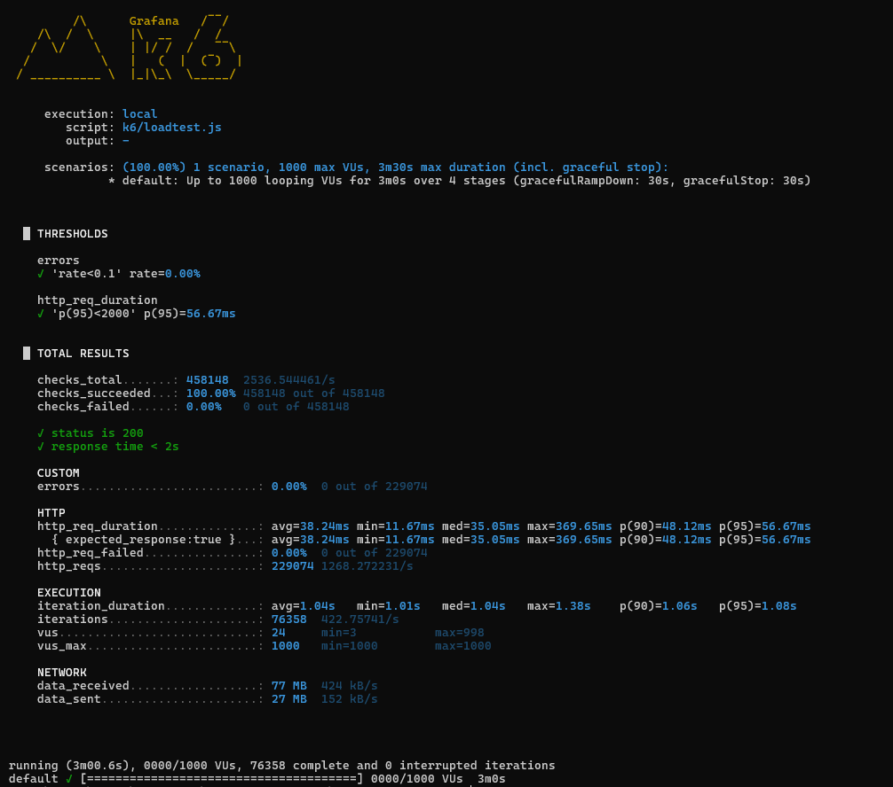

# ⚡ AWS Auto-Scale API

> Production-grade, self-healing infrastructure that handles **1000 concurrent users** at **1,268 req/s** with **zero errors** — fully automated from git push to live deployment.

---

## 🏗️ Architecture

```
                        ┌─────────────────────────────────────────┐
                        │              GitHub Actions              │
                        │   push → build → dockerize → ECR push   │
                        │         → ASG Instance Refresh          │
                        └──────────────────┬──────────────────────┘
                                           │
                                    ┌──────▼──────┐
                                    │  AWS ECR    │
                                    │Docker Images│
                                    └──────┬──────┘
                                           │
          ┌──────────────────────────────── ▼ ────────────────────────────────┐
          │                     AWS VPC (ap-south-1)                          │
          │                                                                    │
          │          ┌─────────────────────────────────────┐                  │
          │          │    Application Load Balancer (ALB)   │ ← HTTP :80      │
          │          └──────────┬──────────────┬───────────┘                  │
          │                     │              │                               │
          │          ┌──────────▼──┐      ┌────▼────────┐                     │
          │          │  EC2 :8080  │      │  EC2 :8080  │   ← Auto Scaling   │
          │          │ ap-south-1a │      │ ap-south-1b │      Group (2-6)    │
          │          └─────────────┘      └─────────────┘                     │
          │                                                                    │
          │   CloudWatch → CPU > 50% → Scale Up (+2)                          │
          │   CloudWatch → CPU < 20% → Scale Down (-1)                        │
          └────────────────────────────────────────────────────────────────────┘
```

---

## 🚀 Tech Stack

| Layer | Technology |
|---|---|
| **Application** | Spring Boot 3.5, Java 21 |
| **Containerization** | Docker, AWS ECR |
| **Infrastructure** | Terraform, AWS VPC, Subnets, IGW |
| **Compute** | AWS EC2 (m7i-flex.large), Auto Scaling Group |
| **Load Balancing** | AWS Application Load Balancer |
| **CI/CD** | GitHub Actions |
| **Monitoring** | AWS CloudWatch, Prometheus, Actuator |
| **Load Testing** | k6 |
| **OS** | Ubuntu 22.04 LTS |

---

## 📊 Load Test Results — 1000 Concurrent Users



```

  █ THRESHOLDS
    errors              ✓ rate=0.00%
    http_req_duration   ✓ p(95)=56.67ms

  █ TOTAL RESULTS
    Total Requests......: 229,074
    Requests/sec........: 1,268 req/s 🚀
    Error Rate..........: 0.00% ✅
    Avg Response Time...: 38.24ms ⚡
    P95 Response Time...: 56.67ms ⚡
    Data Received.......: 77 MB
    Duration............: 3 minutes
    Max VUs.............: 1,000
```

> **229K requests. Zero errors. 38ms average response. 1000 users. Infrastructure auto-scaled and self-healed throughout.**

---

## 🔥 Key Features

### ⚡ Auto Scaling
- Minimum **2 EC2 instances** always running across 2 Availability Zones
- Scales **up by +2 instances** when CPU > 50%
- Scales **down by -1 instance** when CPU < 20%
- Maximum **6 instances** at peak load

### 🔄 Self Healing
- ALB health checks hit `/actuator/health` every 30 seconds
- Unhealthy instance? → Automatically deregistered from ALB
- ASG detects instance count drop → Launches replacement automatically
- **Zero manual intervention required**

### 🚀 Zero-Downtime Deployments
- Git push → GitHub Actions triggers
- New Docker image built and pushed to ECR
- ASG Instance Refresh with `MinHealthyPercentage=50`
- Rolling update — old instances drain, new ones warm up

---

## 📁 Project Structure

```
aws-autoscale-api/
├── src/
│   └── main/java/com/devops/aws_autoscale_api/
│       ├── AwsAutoscaleApiApplication.java
│       └── AppController.java
├── terraform/
│   └── main.tf                 # Complete AWS infrastructure as code
├── k6/
│   └── loadtest.js             # 1000 user load test script
├── .github/
│   └── workflows/
│       └── deploy.yml          # CI/CD pipeline
└── Dockerfile
```

---

## 🛠️ Infrastructure (Terraform)

Everything provisioned as code — **one command to create, one command to destroy:**

```bash
cd terraform
terraform init
terraform apply    # provisions everything in ~5 minutes
terraform destroy  # tears down everything
```

**Resources provisioned (22 total):**
- VPC + 2 Public Subnets (ap-south-1a, ap-south-1b)
- Internet Gateway + Route Tables
- Security Groups (ALB + EC2)
- Application Load Balancer + Target Group + Listener
- Launch Template (Ubuntu 22.04, m7i-flex.large, 20GB gp3)
- Auto Scaling Group (min: 2, max: 6)
- CloudWatch Alarms (high CPU + low CPU)
- Auto Scaling Policies (scale up + scale down)
- ECR Repository
- IAM Role + Instance Profile

---

## 🔌 API Endpoints

| Endpoint | Description |
|---|---|
| `GET /api/hello` | Returns server hostname + timestamp |
| `GET /api/info` | Returns CPU, memory, server stats |
| `GET /actuator/health` | Health check (used by ALB) |
| `GET /actuator/prometheus` | Prometheus metrics |

### Sample Response — `/api/hello`
```json
{
  "message": "Hello from AWS Auto-Scaling Infrastructure!",
  "server": "ip-10-0-1-245",
  "timestamp": "2026-06-03T14:32:11.123456",
  "status": "healthy"
}
```
> The `server` field changes on each refresh — proof the ALB is routing across multiple EC2 instances.

---

## 🧪 Run Load Test

```bash
# Install k6
winget install k6

# Run 1000 user load test
k6 run -e ALB_URL=YOUR_ALB_DNS k6/loadtest.js
```

**Test stages:**
```
0:00 → 0:30  →  ramp up to 100 users
0:30 → 1:30  →  ramp up to 500 users
1:30 → 2:30  →  ramp up to 1000 users  ← ASG scales here
2:30 → 3:00  →  ramp down to 0
```

---

## 🔧 CI/CD Pipeline

```
git push origin main
       │
       ▼
GitHub Actions
       │
       ├── Build JAR (Maven)
       ├── Build Docker Image
       ├── Push to AWS ECR (:latest + :commit-sha)
       └── Trigger ASG Instance Refresh
                  │
                  ▼
         Rolling deployment
         Zero downtime ✅
```

---

## 🛠️ Chaos Engineering — Self Healing Demo

1. Go to AWS Console → EC2 → Instances
2. Terminate any `autoscale-ec2` instance manually
3. Watch ASG detect the drop
4. New instance launches automatically within **60 seconds**
5. Health checks pass → Traffic resumes

**The system heals itself. No alerts. No manual work.**

---

## ⚙️ Setup & Deployment

### Prerequisites
- AWS CLI configured
- Terraform installed
- Docker installed
- Java 21

### Deploy
```bash
# 1. Clone
git clone https://github.com/Sumeet-Y1/aws-autoscale-api

# 2. Provision infrastructure
cd terraform && terraform apply

# 3. Push Docker image to ECR
aws ecr get-login-password --region ap-south-1 | docker login --username AWS --password-stdin ACCOUNT_ID.dkr.ecr.ap-south-1.amazonaws.com
docker build -t aws-autoscale-api .
docker tag aws-autoscale-api:latest ECR_URL:latest
docker push ECR_URL:latest

# 4. Push to GitHub → CI/CD auto-deploys
git push origin main
```

### Destroy
```bash
cd terraform && terraform destroy
```

---

## 👤 Author

**Sumeet** — [GitHub](https://github.com/Sumeet-Y1)